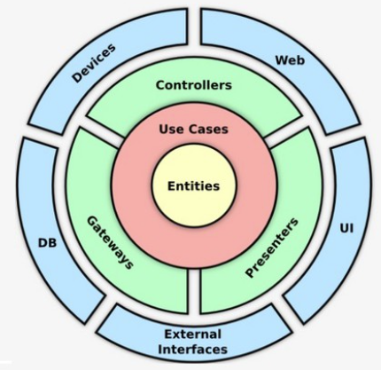
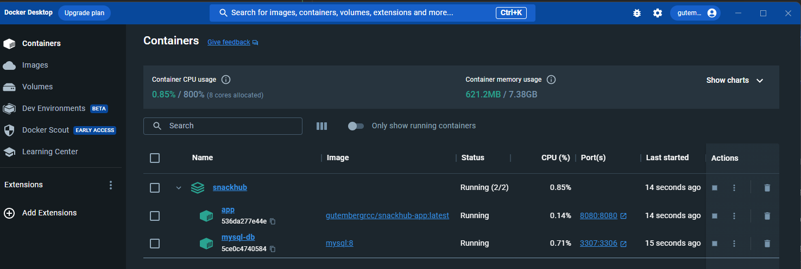
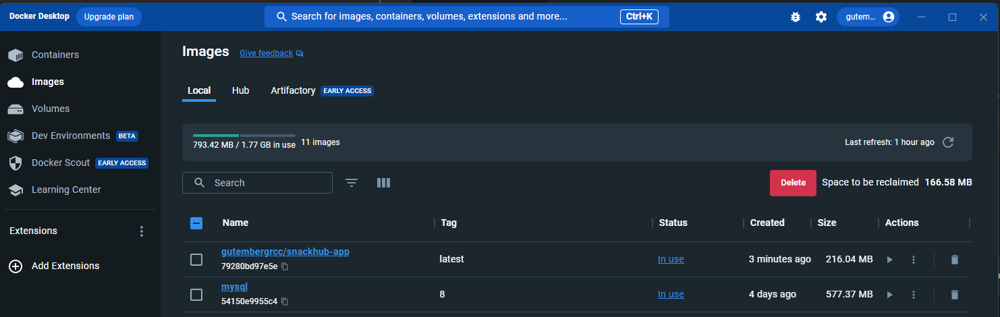
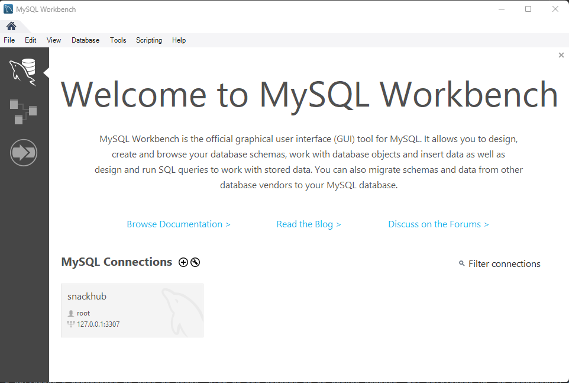
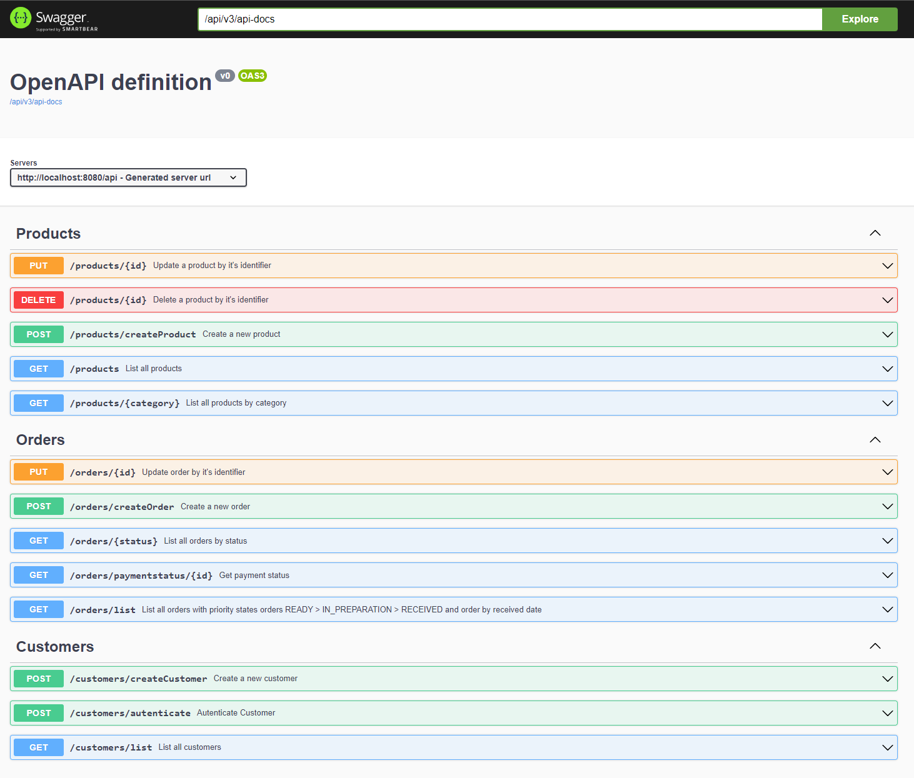

<center>
  <p align="center">
    
    
  </p>  
  <h1 align="center">Clean Architecture</h1>
  <br align="center">
    Este projeto tem a finalidade educacional, como parte do Tech Challenge do Curso de Arquitetura de Software.
</center>

# Conceito

## O que é Clean Architecture?

Clean Architecture, também conhecida como Arquitetura Limpa, é uma abordagem de desenvolvimento de software proposta por Robert C. Martin, um renomado engenheiro de software, autor e consultor. A principal ideia por trás da Clean Architecture é criar sistemas que sejam independentes de frameworks, banco de dados e detalhes de interface do usuário, enfatizando a separação de preocupações e a clareza na organização do código.

O objetivo da Clean Architecture é desenvolver sistemas altamente sustentáveis, testáveis e escaláveis, facilitando a manutenção contínua ao longo do tempo, permitindo a troca de componentes sem alterar a lógica central e tornando o código mais compreensível para novos desenvolvedores que trabalham no projeto.

Essa arquitetura promove a separação de preocupações e permite que cada camada se concentre em sua responsabilidade específica. A ideia é que as dependências fluam de dentro para fora, ou seja, as camadas internas não devem depender das camadas externas, tornando o sistema mais modular e independente.


## Decisão Arquitetural do Desafio

O projeto SnackHub possui três principais módulos:
* Domain
* Application
* Infrastructure

## Domain

Nesse módulo estão presente as nossas classes de dominio, projetadas com a utilização de práticas do DDD. 
No cenário do Clean Architecture representam as Entities. 

As classes presente nesse módulo não possuem nenhuma dependência externa ou de framework.

## Application

A camada de Use Case é responsável por implementar os casos de uso específicos do negócio da aplicação. 
A caracteristica desse módulo é abstrair de regras de negócio: A camada de Use Case contém a lógica do negócio da aplicação, mas sem detalhes de implementação relacionados a infraestrutura ou apresentação.

## Infrastructure

A camada de infraestrutura é uma das camadas principais do Clean Architecture (Arquitetura Limpa) proposta por Robert C. Martin. 
Essa camada é responsável por lidar com os detalhes técnicos, como o acesso a bancos de dados, serviços externos, sistemas de arquivos e outras tecnologias que não são específicas do domínio da aplicação. Sua principal função é permitir a comunicação entre a aplicação e o mundo externo, mantendo a lógica de negócio isolada e independente de detalhes de implementação.

# Vamos Executar?

## Ferramentas necessárias / Pré-requisitos

- JDK 17
- IDE de sua preferência
- Docker
- O banco de dados utilizado é o MySQL, caso queira ver os dados é sugerido a utilização do SGBD mySQL Workbench

## Como executar?

**1. Clonar o repositório:**
```sh
git clone https://github.com/gutembergrcc/snackhub.git
```

**2. Subir a aplicação e o banco de dados MySQL com Docker:**
```shell
docker-compose up -d
```

**3. Após a execução do comando acima será baixado as imagens do MySQL e da Aplicação presente no DockerHub e os containers serão iniciados.**
```
[+] Running 3/3
 ✔ Network snackhub_network     Created                                                                                                                                                                                                                                                                                                                                                                                          0.7s 
 ✔ Container snackhub-mysql-db  Started                                                                                                                                                                                                                                                                                                                                                                                          1.9s 
 ✔ Container snackhub-app       Started 
```
Pronto! Aguarde que em instantes o MySQL irá estar pronto para ser consumido
na porta 3307. Por conflito de porta com a 3306 foi escolhido a local 3307.

Ver imagem abaixo a organização no Docker Desktop:

**- Containers**



**- Images**



O MySQL já estará disponível:



**4. No diretório `src/main/resources/db.migration` está disponível as DDLs a serem executadas com a finalidade de criação das tabelas. O Docker compose inicia a base de dados.**

**5. Como a aplicação também foi inicializada a mesma possui uma interface Swagger, disponível em: http://localhost:8080/api/swagger-ui/index.html**

Além das funcionalidades da Fase 1, foram incluídas:
* Checkout de Pedido, que deverá receber os produtos solicitados e o cliente e retornar a identificação do pedido. (Como sugestão dos professores foi alterado o id de UUID para Number);
* Consultar status de pagamento do pedido, que informa se o pagamento foi aprovado ou não;
* Lista de pedidos ordenado por recebimento e por status.
* Atualizar o status do pedido

Todas essas features novas podem ser vistas abaixo:




## Sou Desenvolvedor, tem informações a mais?

## Docker

`docker-compose.yml`: YAML (Yet Another Markup Language) que é usado para definir, configurar e executar aplicativos multi-container usando o Docker. Em nosso arquivo configuramos 2 serviços,
um para o base de dados e outro para a aplicação. Foi adicionado uma configuração extra, pois as vezes a aplicação subia antes da base de dados, com isso foi configurado alguns Waits.
Nesse mesmo arquivo possui a configuração de rede do docker e os mapeamos de portas dos serviços.

`Dockerfile`: Dockerfile apontando para um image do `eclipse-temurin:17.0.5_8-jre-alpine`. A imagem Docker do Eclipse Temurin permite que você execute aplicativos Java em um ambiente isolado e portátil.
Nesse caso, "17.0.5_8" indica a versão do Java 17.0.5, enquanto "jre" significa que a imagem contém apenas a Java Runtime Environment, que é o ambiente de execução do Java, sem o kit de desenvolvimento (JDK). Por fim, "alpine" refere-se à base da imagem, que é a distribuição leve Alpine Linux
Nesse mesmo arquivo copiamos o Jar gerado pela aplicação, criamos um Usuário e Grupo e executamos o Jar da aplicação.


`Dockerfile.dev`: Muito similar com a configuração acima, a diferença que esse Dockerfile tem o comando para atualizar e regerar o Jar da aplicação.

### Comandos úteis do Docker


Gerar a Imagem da Aplicação atraves do DockerFile
```shell
docker build -t gutembergrcc/snackhub-app .
```

Caso queira gerar o build do Gradle e gerar a imagem, basta executar o comando abaixo:
```shell
docker build -f Dockerfile.dev -t gutembergrcc/snackhub-app:latest .
```

Para subir a imagem para o Hub:
```shell
docker push gutembergrcc/snackhub-app
```

## Quero desenvolver novos Use Cases, qual a forma mais rápida de testar?

1. Caso o desenvolvedor não queira exedutar a geração do .Jar e levantar o Docker, sugiro executar o docker-compose-only-mysql. 
Esse YML contêm apenas o serviço de base de dados e a aplicação poderá ser executada conforme o próximo passo.

```shell
docker-compose -f docker-compose-only-mysql.yml up
```

2. É possível executar como uma aplicação Java através do método main() na classe Main.java

Obs. Com essa abordagem o desenvolvimento se torna mais rápido, pois não teremos que regerar Jar e atualizar no Docker, mas os testes tem
que ser no Docker, pois reflete o ambiente do "Cliente".

## Configuração da Aplicação

Nos arquivos `src/main/resources/application.yml` e `src/main/resources/application-developmente.yml` temos as configurações da aplicação, ou seja:
- Configuração do datasource
- Configuração do JPA
- Configurações do Spring Boot
- Dados de Acesso a base de dados
